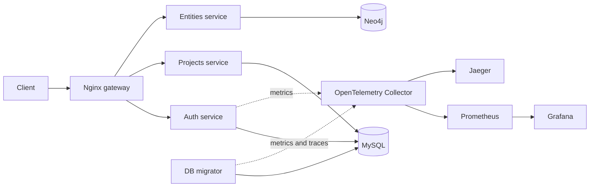

# Storyvision

Storyvision is a project backend for building and exploring fictional worlds. It lets users create collaborative projects and model story data—characters, events, relations, and connections—as a graph.

The repository is a Rust workspace made up of small, independently deployable services. The application is functional and has a complete local development stack, but it is still being hardened for automated delivery and production-like operation.

## What is implemented

- User registration, login, refresh-token rotation, logout, and current-user lookup
- JWT authentication shared by the API services
- Project creation, listing, metadata updates, deletion, and member management
- Character, event, relation, and connection management in Neo4j
- Complete project-graph retrieval and JSON graph import
- MySQL schema, seed-data, rollback, cleanup, and dry-run migration modes
- Health endpoints and graceful shutdown for the API services
- OpenAPI/RapiDoc documentation for the Auth API
- Local metrics and tracing with OpenTelemetry, Prometheus, Grafana, and Jaeger
- Docker Compose profiles for running individual parts of the stack
- Development Kubernetes manifests

## Architecture



The workspace contains four Rust packages:

| Package | Responsibility | Storage |
| --- | --- | --- |
| `auth_service` | Users, credentials, access tokens, and sessions | MySQL |
| `projects_service` | Project metadata, ownership, and membership | MySQL |
| `entities_service` | Characters, events, relations, connections, and graph import | Neo4j |
| `migrator_service` | MySQL schema and development seed data | MySQL |

Application code follows a feature-based structure. A feature normally owns its HTTP handler, use case, DTOs, and error mapping instead of being split across global controller and service directories.

## Technology

- Rust 2024, Axum, and Tokio
- SQLx and MySQL
- `neo4rs` and Neo4j with APOC
- JWT and Argon2
- Docker, Docker Compose, and Nginx
- Kubernetes manifests
- OpenTelemetry Collector, Prometheus, Grafana, and Jaeger
- Utoipa and RapiDoc

The Rust toolchain is pinned in `rust-toolchain.toml`; rustup installs the required Clippy and rustfmt components automatically.

## Getting started

### Requirements

- Docker with Docker Compose
- Rustup when running services or checks outside containers
- [Task](https://taskfile.dev/) if you want to use the optional command shortcuts
- `kubectl` only when working with the Kubernetes manifests

### Configure the environment

Create a local environment file:

```bash
cp .env.example .env
```

Fill in at least the MySQL and Neo4j credentials, `SALT`, and `TOKEN_SECRET`. The token secret must be at least 32 bytes. The `.env` file is ignored by Git and must not be committed.

### Start the application

Start MySQL first:

```bash
docker compose up -d
```

Apply the MySQL schema:

```bash
docker compose --profile migration up db_migrator
```

Start the three API services and the gateway:

```bash
docker compose --profile core --profile graph --profile gateway up -d
```

The gateway is available at `http://localhost:8081`. Its health endpoint is:

```text
GET http://localhost:8081/healthcheck
```

To start the complete local stack, including observability:

```bash
docker compose --profile all up -d
```

Useful local interfaces:

| Component | Address |
| --- | --- |
| API gateway | `http://localhost:8081` |
| Neo4j Browser | `http://localhost:7474` |
| Grafana | `http://localhost:3000` |
| Jaeger | `http://localhost:16686` |
| Prometheus | `http://localhost:9099` |

Stop the stack with:

```bash
docker compose --profile all down
```

Add `--volumes` only when you intentionally want to delete local database and Grafana data.

### Start Jenkins

Jenkins has its own Compose profile and does not start with the application stack. Give the container access to the host Docker socket group and start it with:

```bash
DOCKER_GID="$(stat -c '%g' /var/run/docker.sock)" \
docker compose --profile ci up -d --build jenkins
```

Or use the Taskfile shortcut:

```bash
task jenkins
```

Open Jenkins at `http://localhost:8080`. Retrieve the one-time setup password with:

```bash
docker compose --profile ci exec jenkins \
  cat /var/jenkins_home/secrets/initialAdminPassword
```

Jenkins state and plugins persist in the `jenkins_home` volume. The repository-root `Jenkinsfile` defines version discovery, formatting, Clippy, tests, and Compose validation. Configure it as a GitHub Multibranch Pipeline so Jenkins checks out the exact branch or pull-request revision.

The pipeline uses SCM polling instead of a GitHub webhook. `pollSCM('H/5 * * * *')` checks known branches approximately every five minutes, with Jenkins choosing a stable offset through `H`. In the Multibranch Pipeline configuration, also enable **Scan Multibranch Pipeline Triggers → Periodically if not otherwise run** so Jenkins discovers new branches and pull requests; a 5–15 minute interval is appropriate for this pet project.

The Docker socket grants the Jenkins container control over the host Docker daemon. This setup is intended for a trusted local CI host; do not run untrusted pipelines or fork pull requests with privileged credentials on it.

### Task shortcuts

The root `Taskfile.yaml` provides shortcuts for common operations:

```bash
task core        # MySQL, Auth, and Projects
task nginx       # Gateway and its required services
task migrate     # Apply the default MySQL migration
task migrate -- 3 # Apply migrations and development seed data
task monitoring  # OTel Collector, Prometheus, Grafana, and Jaeger
```

### Run a service with Cargo

Infrastructure still needs to be available and the required environment variables must be set.

```bash
cargo run -p auth_service
cargo run -p projects_service
cargo run -p entities_service
```

## API outline

All business routes are versioned under `/v1`:

```text
/v1/auth       registration, login, refresh, logout, and current user
/v1/projects   project CRUD and membership
/v1/entities   characters, events, relations, connections, graph, and import
```

The Auth service exposes RapiDoc at `/rapidoc` and its OpenAPI document at `/api-docs/openapi.json` when accessed directly. A Postman collection is available in `postman.json` for broader API exploration.

Each API service also exposes `/healthcheck`; Auth additionally exposes `/db_healthcheck`.

## Database migrations

The migrator selects its operation through `MIGRATION_TYPE`:

| Value | Operation |
| --- | --- |
| `1` | Apply schema |
| `2` | Revert schema |
| `3` | Apply schema and insert development data |
| `4` | Apply schema and clear development data |
| `5` | Validate connectivity and migration files without changing data |

For example:

```bash
MIGRATION_TYPE=5 docker compose --profile migration up db_migrator
```

## Development checks

Run the same baseline checks intended for CI before submitting changes:

```bash
cargo fmt --all -- --check
cargo clippy --workspace --all-targets --all-features -- -D warnings
cargo test --workspace --all-targets --all-features
docker compose config --quiet
```

Formatting and strict Clippy checks currently pass. Automated coverage is still small, so successful compilation is not yet a substitute for integration testing.

## Kubernetes

The `k8s/` directory contains development manifests for MySQL, migrations, Auth, Projects, and ingress routing. They are a starting point, not a production deployment.

Secret values are not stored in Git. Create `k8s/.secrets/mysql.env` from the provided example and apply it through the Taskfile:

```bash
cp k8s/.secrets/mysql.env.example k8s/.secrets/mysql.env
task k8s_apply_secrets MYSQL_ENV=k8s/.secrets/mysql.env
```

Never commit the populated environment file. Production deployment still needs immutable registry images, probes, resource policies, external secret management, database backups, and environment-specific configuration.

## Current project state

Storyvision is currently a development-stage backend:

| Area | State |
| --- | --- |
| Core API behavior | Implemented across Auth, Projects, and Entities |
| Local environment | Complete Compose stack with gateway and observability |
| Security baseline | Plaintext repository secrets and sensitive logging removed |
| Code quality | Pinned toolchain; rustfmt and strict Clippy baseline established |
| Automated tests | Minimal; meaningful integration and end-to-end coverage is needed |
| CI/CD | Not implemented yet; this is the next infrastructure milestone |
| Kubernetes | Development manifests only |
| Observability | Local foundation exists; coverage, dashboards, and alerts are incomplete |
| Production readiness | Not production-ready |

## Near-term roadmap

1. Add pull-request CI for formatting, Clippy, tests, dependency auditing, secret scanning, container builds, and manifest validation.
2. Add Auth and project-authorization integration tests backed by MySQL.
3. Add Neo4j integration tests for entity and graph operations.
4. Standardize OpenAPI coverage, error responses, metrics, and tracing across services.
5. Build immutable container images and a reproducible staging deployment.
6. Harden Kubernetes workloads and establish backup, alerting, and recovery procedures.
